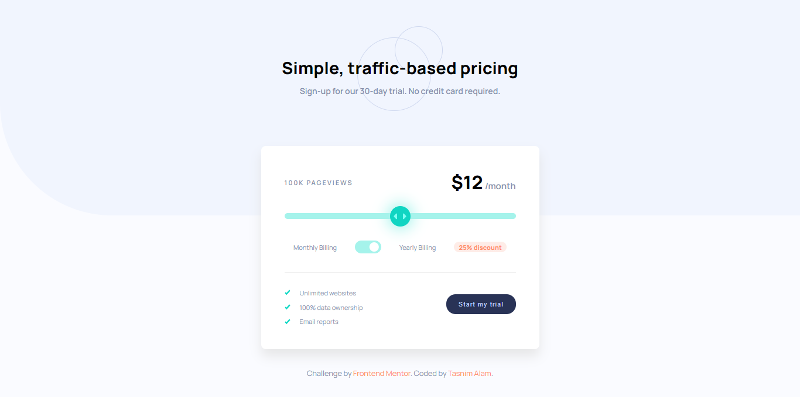

# Frontend Mentor - Interactive pricing component solution

This is a solution to the [Interactive pricing component challenge on Frontend Mentor](https://www.frontendmentor.io/challenges/interactive-pricing-component-t0m8PIyY8). Frontend Mentor challenges help you improve your coding skills by building realistic projects.

## Table of contents

- [Overview](#overview)
  - [The challenge](#the-challenge)
  - [Screenshot](#screenshot)
  - [Links](#links)
- [My process](#my-process)
  - [Built with](#built-with)
  - [What I learned](#what-i-learned)
- [Author](#author)

## Overview


### The challenge

Users should be able to:

- View the optimal layout for the app depending on their device's screen size
- See hover states for all interactive elements on the page
- Use the slider and toggle to see prices for different page view numbers

### Screenshot



### Links

- Solution URL: [Repository]()
- Live Site URL: [Live Preview]()

## My process

### Built with

- Semantic HTML5 markup
- Flexbox
- CSS Grid

### What I learned

```js
function updatePrice() {
  const basePrice = range.value;
  let finalPrice = basePrice;

  if (circle.classList.contains("clicked")) {
    finalPrice = basePrice * 0.75;
  }

  price.textContent = `$${finalPrice}`;
}

range.oninput = function () {
  rate.textContent = `${range.value * 6.25}K PAGEVIEWS`;

  updatePrice();
};

toggle.addEventListener("click", function () {
  toggle.classList.toggle("active");
  circle.classList.toggle("clicked");
  updatePrice();
});
```

## Author
- Website - [Tasnim Alam](https://github.com/Tasnim005)
- Frontend Mentor - [Tasnim005](https://www.frontendmentor.io/profile/Tasnim005)


